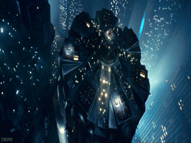

# SAROO Backgrounds - Blade Runner

### How to use

Download your preferred `7z` file with both `mainmenu_bg.gif` and `bgsound_r.pcm` files, unzip and put them under `/SAROO/` root folder.
They should follow this structure:

<pre>
(Your SD Disk Location):\SAROO
ISO (folder)
update (folder)
> bgsound_r.pcm (pasted file)
> mainmenu_bg.gif (pasted file)
mcuapp.bin (file)
saroocfg.txt (file)
SS_BUP.BIN (file)
SS_MEMS.BIN (file)
SS_SAVE.BIN(file)
ssfirm.bin (file)
</pre>

### Content

All background images were made by sceneCAT - [Source](https://retrogametalk.com/threads/saroo-backgrounds-thread.9520/)

[Blade Runner 1](downloads/blade-runner/blade-runner01.7z)

[Blade Runner 2](downloads/blade-runner/blade-runner02.7z)

[Blade Runner 3 - Voight 1](downloads/blade-runner/blade-runner03.7z)

[Blade Runner 4 - Voight 2](downloads/blade-runner/blade-runner04.7z)

[Blade Runner 5 - Joi 1](downloads/blade-runner/blade-runner05.7z)

[Blade Runner 6 - Joi 2](downloads/blade-runner/blade-runner06.7z)

[Blade Runner 7](downloads/blade-runner/blade-runner07.7z)

[Blade Runner 8](downloads/blade-runner/blade-runner08.7z)

