# SAROO Backgrounds

### About

Collection of background images (gifs) and songs for SAROO using the firmware v0.5 and upwards.

### How to use

Download your preferred `7z` file with both `mainmenu_bg.gif` and `bgsound_r.pcm` files, unzip and put them under `/SAROO/` root folder.
They should follow this structure:

<pre>
(Your SD Disk Location):\SAROO
ISO (folder)
update (folder)
> bgsound_r.pcm (pasted file)
> mainmenu_bg.gif (pasted file)
mcuapp.bin (file)
saroocfg.txt (file)
SS_BUP.BIN (file)
SS_MEMS.BIN (file)
SS_SAVE.BIN(file)
ssfirm.bin (file)
</pre>

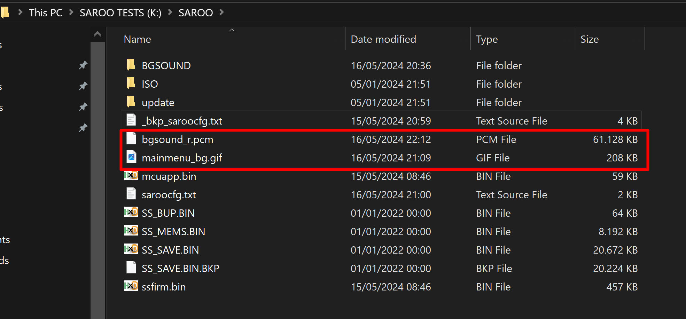

### How to generate my own background image and sound

TODO

### Content

[Spawn - HBO Animation (Image + Music)](downloads/others/spawn-hbo-animation.7z)

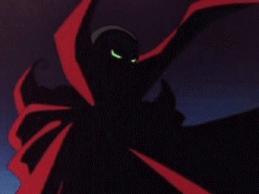

[Snatcher (Image + Music)](downloads/others/snatcher.7z)

[Road Rash (Image + Music)](downloads/others/road-rash.7z)

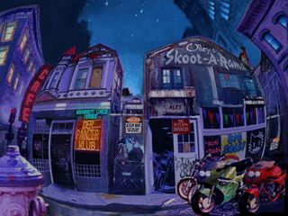

[Junker HQ (Image + Music)](downloads/others/junker-hq.7z)

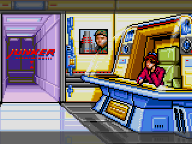

[Clean (Image + Music)](downloads/others/clean.7z)

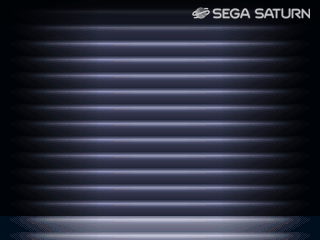

[Space (Image)](downloads/others/space.7z)

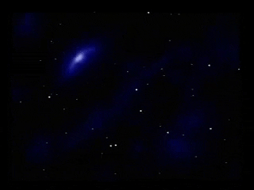

[Spaceship (Image)](downloads/others/spaceship.7z)

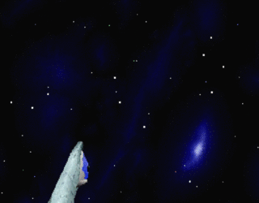

[X-Men (Image)](downloads/others/xmen.7z)

[Mega Man X (Image + Music)](downloads/megaman/megaman-x.7z)

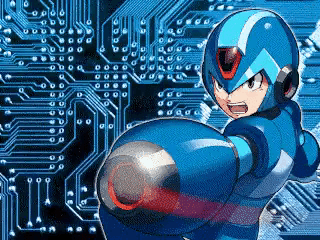

[Mega Man (Image + Music)](downloads/megaman/megaman.7z)

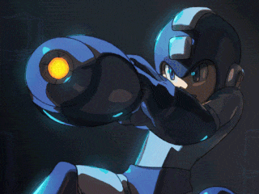

[NiGHTS Into Dreams... (Image + Music)](downloads/others/nights-into-dreams.7z)

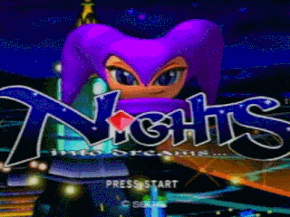

[SEGA (Image)](downloads/others/sega.7z)

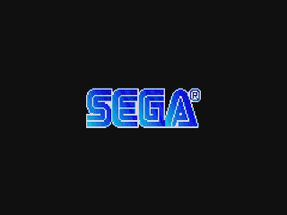

[SEGA Bubbles (Image)](downloads/others/sega-bubbles.7z)

