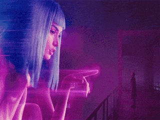
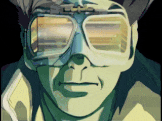

# SAROO Backgrounds

## About

Collection of background images (gifs) and songs for SAROO using the firmware v0.5 and upwards.

Other links related to SAROO:

- [Official Repository](https://github.com/tpunix/SAROO)
- [Where to Buy](Info/Buy/README.md)
- [Compatibility List](https://github.com/williamdsw/saroo-compatibility-list)
- [Configuration List](https://github.com/williamdsw/saroo-configuration-list)
- [Playlist with Tested Games on YouTube (+ 1180 videos)](https://www.youtube.com/playlist?list=PLmsMlzwbRlgLngxWI9ZzPK44Gix1Ek-ZO)

## How to use

Download your preferred `7z` file with both `mainmenu_bg.gif` and `bgsound_r.pcm` files, unzip and put them under `/SAROO/` root folder.
They should follow this structure:

<pre>
(Your SD Disk Location):\SAROO
ISO (folder)
update (folder)
> bgsound_r.pcm (pasted file)
> mainmenu_bg.gif (pasted file)
mcuapp.bin (file)
saroocfg.txt (file)
SS_BUP.BIN (file)
SS_MEMS.BIN (file)
SS_SAVE.BIN(file)
ssfirm.bin (file)
</pre>

## How to generate my own background image and sound

TODO

## Content

### A

### B

[Blader Runner Backgrounds by sceneCAT](./BladeRunner.md)

[Bomb the Bass Static by sceneCAT](downloads/others/bomb-the-bass-static.7z)

### C

[Clean](downloads/others/clean.7z)

### E

[Extra by sceneCAT](downloads/others/extra.7z)

### F

[Fallout 3 by sceneCAT](downloads/others/fallout-3.7z)

[Full Contact by sceneCAT](downloads/others/full-contact.7z)

### F

[Ghost in the Shell by sceneCAT](downloads/others/ghost-in-the-shell.7z)

### J

[Junker HQ](downloads/others/junker-hq.7z)

### M

[Mega Man](downloads/megaman/megaman.7z)

[Mega Man X](downloads/megaman/megaman-x.7z)

### N

[NiGHTS Into Dreams...](downloads/others/nights-into-dreams.7z)

### P

[Panzer Dragoon](downloads/others/panzer_dragoon.7z)

[Policenauts by sceneCAT](downloads/others/policenauts.7z)

### R

[Road Rash](downloads/others/road-rash.7z)

### S

[Saturn by sceneCAT](downloads/others/saturn.7z)

[SEGA Logo](downloads/logos/sega/sega.7z)

[SEGA Logo Bubbles](downloads/logos/sega/sega-bubbles.7z)

[SEGA Logo on Sonic 3D Blast](downloads/logos/sega/sega-sonic-3d.7z)

[SEGA Saturn](downloads/others/sega-saturn.7z)

[Snatcher 1](downloads/snatcher/snatcher01.7z)

[Snatcher 2 by sceneCAT](downloads/snatcher/snatcher02.7z) - [Source](https://retrogametalk.com/threads/saroo-backgrounds-thread.9520/)

[Space](downloads/others/space.7z)

[Spaceship](downloads/others/spaceship.7z)

[Spawn - HBO Animation](downloads/others/spawn-hbo-animation.7z)

### X

[Xeno Crisis by sceneCAT](downloads/others/xeno-crisis.7z)

[X-Men](downloads/others/xmen.7z)

